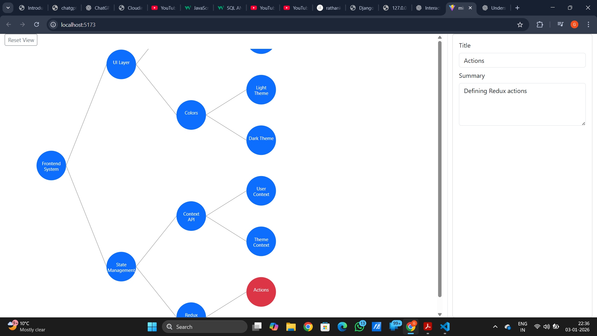
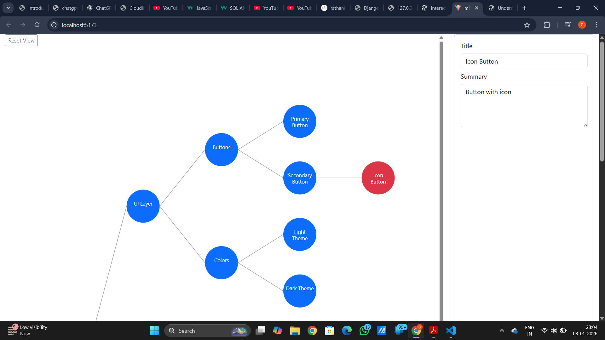
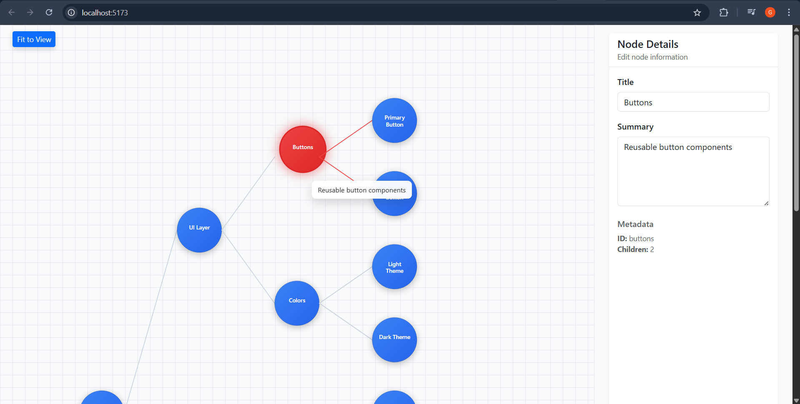

# MindMap – Frontend

##  Overview
This project implements an interactive, data-driven mind map UI that visualizes
hierarchical frontend concepts.

##  Live Demo

[View Live App](https://mind-map-git-main-rajpushpits-projects.vercel.app/)

## Video Demo
[Watch Video](https://drive.google.com/file/d/1mTsMOvXEOXWYiOy0WMzhzAqlzMj6BcfV/view?usp=drive_link)


The mind map supports:
- Expand / Collapse nodes
- Hover tooltips (preview text only)
- Side panel editing of node data
- Fit to View / Reset View
- Local data persistence
- Reset data to original JSON

## Screenshots







##  Features
- Fully data-driven mind map (JSON-based)
- Recursive SVG rendering
- Expand / collapse nodes
- Hover tooltips with preview text only
- Side panel for full node editing
- Fit to View & Reset View controls
- Persistent edits using localStorage
- Reset to original data


## 🛠 Technologies Used
- **React** – Component-based UI
- **Vite** – Fast development server and build tool
- **JavaScript (ES6+)**
- **SVG** – For rendering the mind map
- **Bootstrap** – UI layout and styling

---

##  Libraries Used 
React
Used for building a component-based, interactive UI
Enables declarative rendering and efficient state updates
Makes the mind map modular (MindMap, SidePanel, App)

**React Hooks** (`useState`, `useEffect`, `useRef`, `useLayoutEffect`)  
  → For state management, DOM measurement, and UI updates
  
  **LocalStorage API**  
  → To persist edited mind map data
---

##  Architecture & Approach
- The mind map data is stored in a hierarchical JSON structure.
- Each node contains `id`, `title`, `summary`, and `children`.
- The tree is rendered recursively using SVG elements.
- Clicking a node toggles expand/collapse.
- Hovering a node shows a short tooltip preview.
- Full node details can be edited in the right-side panel.
- Changes are saved automatically to localStorage.

---

##  Data Flow
1. Initial data is loaded from `mindmap.json`
2. Data is stored in React state (`useMindMap` hook)
3. SVG renders the tree recursively
4. User interactions update the state
5. State changes persist to `localStorage`
6. UI re-renders automatically

---

##  Getting Started

### Step 1: Go to project directory
```bash
cd mindmap_frontend
```
### Step 2: Install dependencies
```bash
npm install
```

### Step 3: Run the development server
```bash
npm run dev
```

### Open your browser and visit:
```bash
http://localhost:5173
```

## Working Flow
```text
┌──────────────────────┐
│   mindmap.json       │
│  (Structured Data)   │
└──────────┬───────────┘
           │
           │  import
           ▼
┌──────────────────────┐
│   useMindMap Hook    │
│  - holds tree state  │
│  - handles collapse  │
│  - manages selection │
└──────────┬───────────┘
           │
           │ props
           ▼
┌─────────────────────────────────────┐
│              App.jsx                │
│  - layout (Bootstrap grid)          │
│  - connects MindMap & SidePanel     │
└──────────┬───────────────┬───────── ┘
           │               │
           │               │
           ▼               ▼
┌──────────────────┐   ┌──────────────────┐
│   MindMap.jsx    │   │  SidePanel.jsx   │
│  (SVG Canvas)    │   │  (Details View)  │
│  - renders nodes │   │  - shows summary │
│  - hover tooltip │   │  - updates on    │
│ - expand/collapse│   │  - selection     │
└──────────────────┘   └──────────────────┘

```


## INTERACTION FLOW DIAGRAM
```test

User Hover Node
     │
     ▼
 Tooltip (summary only)

User Click Node
     │
     ▼
toggleCollapse()
     │
     ▼
State Updated (useMindMap)
     │
     ▼
MindMap Re-renders
     │
     ▼
SidePanel Updates
```

“The application is fully data-driven. The mindmap structure is stored in a JSON file, 
which is loaded into a custom hook that manages all state and interactions. 
The App component coordinates data flow, while the MindMap component focuses on SVG rendering and interactions. 
The SidePanel reacts to selection changes and displays contextual information. This separation ensures scalability and maintainability.”
